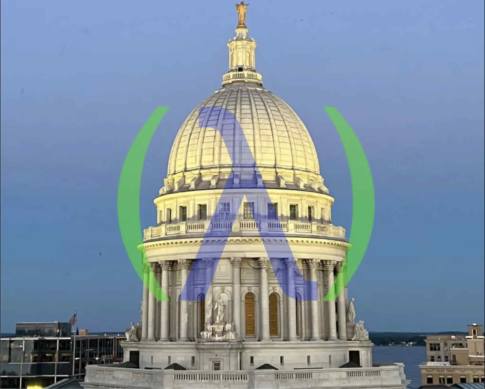

# madclj.com

Website for Madison Clojure.

## Usage

Install [Hugo](https://gohugo.io/installation/).

Run `./serve.sh` to start the server.

## Creating a new event

0. Create a new pinned announcement in https://github.com/orgs/madclj/discussions
   - note only pinned announcements get rsvp counts
1. Add a new entry to `madison-clojure.events/events` with the url to discussion as the `:rsvp`
