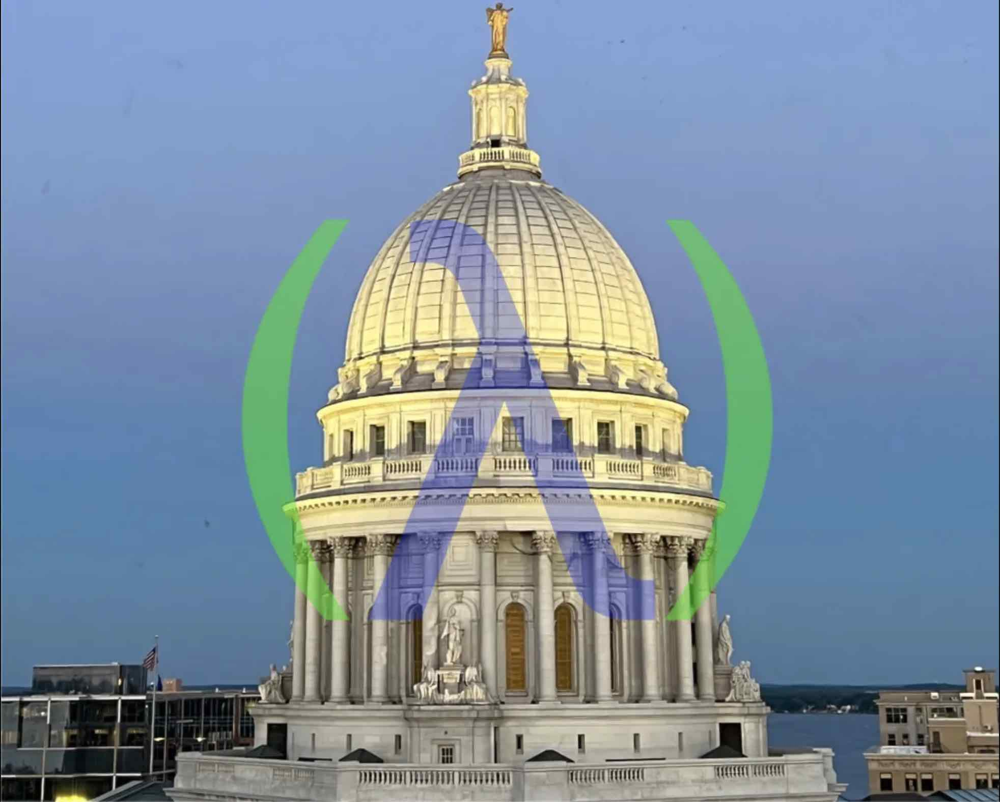

# madclj.com

Website for Madison Clojure.

## Usage

Install [Hugo](https://gohugo.io/installation/).

Run `./serve.sh` to start the server.

## Creating a new event

1. Create a new pinned announcement in https://github.com/orgs/madclj/discussions
   - note only pinned announcements get rsvp counts
2. Add a new entry to `madison-clojure.events/events` with the url to discussion as the `:rsvp`

## FAQ

Q: RSVP counts are not updating on madclj.com.
A: Ensure the latest announcements are pinned, and that the [scheduled workflow updating RSVP's](https://github.com/madclj/madclj.com/actions/workflows/hugo.yaml) is not disabled due to inactivity.
